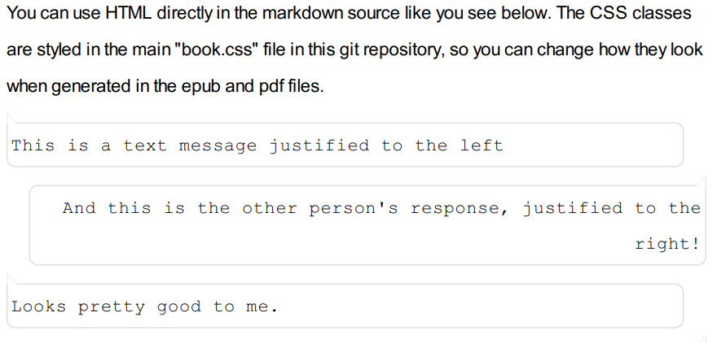
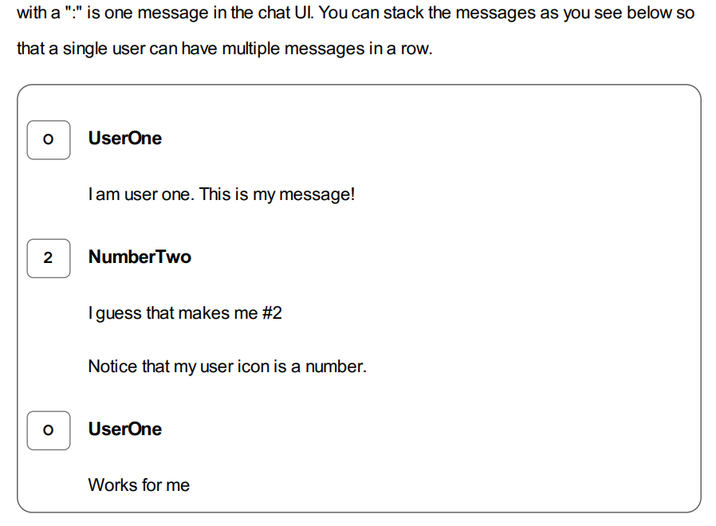

# Booker

Booker is a very simple generator for books based on markdown source files. This is NOT a fancy user interface for managing and generating books. It is a very techie-focused library for those of us that like that sort of thing.


## Okay, so what do I do with this?

Click on the "Use this template" button in GitHub to create a new repo, then start writing your book. **All of your content needs to go in the `chapters` directory**. Use [basic Markdown](https://daringfireball.net/projects/markdown/syntax) (along with some custom styling found in the `book.css` file) to create your content. Install the dependencies (see below) and run a command (see below) to generate PDF, ePub, and docx versions of your book.


### Generating a Book

There are PowerShell (Windows) and Bash (everyone else) scripts to generate things, but you'll need to install a couple dependencies first.

1. Install [wkhtmltopdf](https://wkhtmltopdf.org/)
2. Install [pandoc](https://pandoc.org/)
    * NOTE: make sure to get the latest pandoc, especially on linux (aptitude has a very old version)
3. Double check that all of your content is in the `chapters` directory (and in the order you want it to appear in the book)
4. Run either the `build.sh` (bash) or `build.ps1` (PowerShell) script
5. Open your book from the `output` directory

> Note that this outputs 3 versions of your book by default: pdf, ePub, and a docx manuscript. See below for options.

#### Versioning

You can use the `-BumpLevel` CLI option to bump the `major`, `minor`, or `patch` version and automatically create a git tag. This will also insert the version/build into the PDF and ePub file's title page (that is, if you use the default latex template).

For example: `.\build.ps1 -BumpLevel minor` or `./build.sh -BumpLevel minor`

> **Warning**: you need to manually create a tag the first time (like `git tag v1.0.0`)

#### Limit Output

You may only want the PDF or ePub document, which you can specify with the `-OnlyRun` option. This will limit output to whichever type you specify. Valid options are `pdf`, `epub`, and `manuscript`


### What is the "manuscript"?

If you plan to submit your book to agents or publishers it is common to give them a document in standard manuscript format. Below are the general restrictions on that format, which are implemented through a `docx` template file. Note that _none of the CSS is applied to this manuscript_. You can alter the formatting and styles of the manuscript by editing the `template-manuscript.docx` file.

* Pages are 8.5 x 11 inches with 1 inch margins on all sides
* Font is Times New Roman, 12 point (although some things are not, like using a monospace for preformatted/code blocks)
* Paragraphs are indented 0.5 inches with double spaced lines and left justified (not full-page justification)
* On the first page, in the top left corner, is the title, author name, and contact information (if present in the common config)
* Page numbers begin with one (1) are on every page in the footer, along with the book's title
* The word "END" appears after the last line in the book


### Custom Styling

The scripts first convert your markdown into HTML, then apply the CSS, before converting to PDF and ePub formats. As such, you can use pretty much any HTML and CSS you want. That said, you should **test these thoroughly** as the conversion process can get messy with anything fancy (especially relating to positioned elements).

There are a few built-in custom styles you can use if you wish. For example, adding a `---` in a chapter will create a 3-asterisk, centered scene break. The fist letter of every chapter is larger and takes up a few lines.

> **NOTE**: some of the custom styling in the `book.css` file assumes you use `##` for chapter titles (which will be converted into an `<h2>` in the intermediary HTML).


#### Text Chain Example

You can create mobile text chain styling in your output by adding some simple HTML with a couple basic CSS classes. You can see these in action in the example chapter 01, but below is a simple version and the output.

```
<p class='text-chain-left'>
This is a text message justified to the left
</p>

<p class='text-chain-right'>
And this is the other person's response, justified to the right!
</p>
```



#### Chat System Example

Another built-in custom style is a basic chat system visual. You can also see this in action in chapter 01, or below.

```
OUserOne
: I am user one. This is my message!

2NumberTwo
: I guess that makes me #2
: Notice that my user icon is a number.
```




## I don't really like the template, can I change it?

Of course! Open up the `tempalte-pdf.latex` or `template-epub.latex` files and tinker with them! You can't really screw it up, because you can always revert to the stock templates in this source repo. You'll also want to modify the `book.css` file to change how things like, for example the fonts, indentation and other spacing, etc.

### Debugging

Something not quite working in the generated output files? Go into the `config-pdf.yaml` file and switch the `output-file` option to be `.\output\book.html` (note the "html" at the end). This will stop generation at the source HTML **before** it is converted to PDF (so you won't get the PDF file). Now you can inspect that file. Ensure the HTML is what you expect, that the CSS is loading properly, and that all JS is present.

## Author & License

Hi, my name is [Jordan Kasper](https://jordankasper.com). I'm a software engineer, conference speaker, and general technophile. I created this out of a need for myself (and because I'm a complete dork).

This repo is released under the MIT license.
